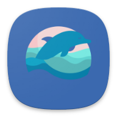

# 🌊 아픈 바다를 깨끗하게, 나랑해

<p align="center"></p>

```
📢 SSFAY 9기 공통 프로젝트
📢 Team. 보노보노
📢 23.07.04 ~ 23.08.14 (총 7주)
```
<br/>

---

## 📬 1. 나랑해 소개

### 바다가 아파하고 있다는 사실 알고 계셨나요?
매 여름마다 방문하는 바다. 매년 전국 바다에서 수거되는 쓰레기가 12만톤이 넘어간다는 사실 알고계셨나요? 해양 쓰레기 절감을 위해 다양한 캠페인이 있습니다. 
나랑해에서 게임, 일일미션, 커뮤니티 등으로 더 쉽고 재밌게 해양 쓰레기 절감에 동참해보세요! 

<br/>

---

<br/>
